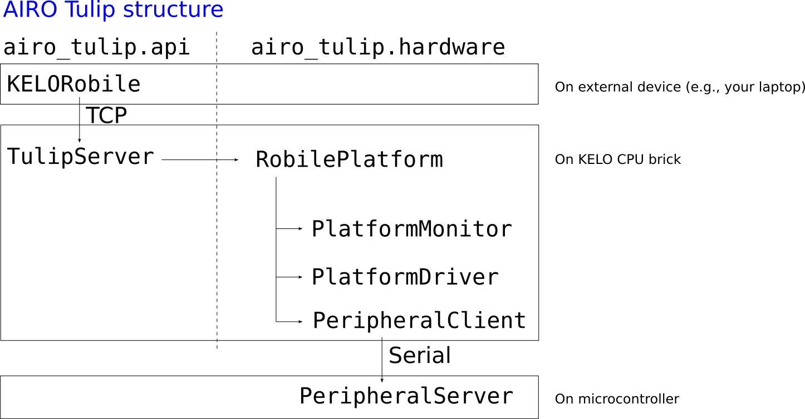

# How it works

The `airo-tulip` package consists of the following main Python classes and files:
- `RobilePlatform`: the main class for representing a complete KELO Robile system. It initializes the various drives of the robot via EtherCAT and handles the higher-level operations of the system.
- `PlatformDriver`: driver for transmitting specific setpoints for the wheel to all drives. Controls the state of the drives and startup procedure.
- `PlatformMonitor`: module that reads out the sensor data from EtherCAT messages and caches them for later retrieval.
- `VelocityPlatformController`: controller that calculates the setpoints for each wheel in velocity mode. One can set a target velocity in 2D for the complete platform and this controller will convert that to angular velocities for each of the drives.

The `PlatformDriver` can be set to "compliant mode" with different levels of compliance.

The `RobilePlatform` class instantiates a `PlatformDriver` and a `PlatformMonitor` in its constructor. These objects are available in the `driver` and `monitor` properties of the `RobilePlatform` class respectively. The `VelocityPlatformController` is instantiated by the `PlatformDriver` but not available through properties in the `PlatformDriver`. One can set a target velocity using a wrapper method in the `RobilePlatform` class.

## Communication with `airo-tulip`

The `airo-tulip` package has a subpackage called `api`. When working with the KELO Robile platform, you want to run the `TulipServer` on boot, typically,
so that commands can be sent over the network. The `TulipServer` takes a desired IP address and port, which can be used to connect to it via a client.

The server is implemented via [0MQ](https://pyzmq.readthedocs.io/en/latest/), so it does not work over raw TCP sockets, but rather uses a higher level of abstraction.
The server accepts messages, defined in `airo_tulip.api.messages`, which can be sent using `zmq.Socket.send_pyobj`: these messages are pickled,
resp. unpickled, and contain the relevant information to drive the KELO Robile system via the `RobilePlatform` interface.

We provide an example client implementation in `airo_tulip.api.client`.
The [airo-mono](https://github.com/airo-ugent/airo-mono) repository, more specifically `airo-robots`, also provides
a wrapper for this implementation.

## Velocity limits

The drives of the KELO Robile are quite strong, so care should be taken when controlling them.
The `airo-tulip` package incorporates various safety checks to limit the speed and torque of each of the wheels.

For example, one cannot set a platform target velocity higher than 0.5 m/s linear or pi/8 rad/s angular in the wrapper method of the `RobilePlatform` class.
The acceleration and deceleration of each drive is limited to 0.5 m/s^2 linear and 0.8 m/s^2 angular by attributes of the `PlatformLimits` dataclass that is used in the `VelocityPlatformController`.
Additionally, the value for each wheel setpoint is once more limited by the `_wheel_set_point_max` attribute in the `PlatformDriver` class.
The maximum current that the motors of each drive will supply is limited to 20 amps during acceleration and 1 amp during braking, as specified in each EtherCAT message that is transmitted.

Do not overrule or change these limits unless you really need them and know what you're doing!

## EtherCAT

The KELO Robile makes use of an EtherCAT bus for communication between the various modular bricks.
As such, the integrated compute brick on which the `airo-tulip` package runs, needs to send and receive EtherCAT messages to and from this shared bus.
For this, we make use of the `PySOEM` library.

An EtherCAT bus works by daisy-chaining nodes on the bus.
To communicate over the bus, an EtherCAT telegram is constructed on the master node (the compute brick in the case of a KELO Robile) and transmitted on the bus to the first slave device.
The first slave device checks if there is any data in the telegram for itself, reads it and optionally write its own data into the telegram.
It also increases the *working counter* field in the telegram if it read or wrote from or to the telegram.
Finally, the slave device sends the telegram to the next device in the chain.
At the end, the telegram is reflected and sent back to the master.
A neat animation visualizing the workings of an EtherCAT bus can be found [here](https://en.wikipedia.org/wiki/File:EthercatOperatingPrinciple.webm).

The `RobilePlatform` class creates a `pysoem.Master` object that controls the EtherCAT bus.
After the initialisation process described in `RobilePlatform.init_ethercat()`, each of the drives connected to the EtherCAT bus is represented as a slave device under this master object.
One can read from each slave device using the `output` buffer and write to it using `input` buffer.
The contents of these buffers is represented by the `TxPDO1` and `RxPDO1` structs specified in `ethercat.py`.
The naming of these buffers might be a bit counterintuitive as you need a `TxPDO1` struct and the `output` buffer to read from a slave device, so be cautious!
We've provided the `_get_process_data()` and `_set_process_data()` functions to easily read and write from the buffers using the `TxPDO1` and `RxPDO1` structs.

Note that you'll find that there are 9 slaves in total: 2 times 4 drives and 1 compute unit.
Only one of the two slaves for each drive is addressable via input and output buffers, the other doesn't have any.

Drives continuously need to receive EtherCAT telegrams in order for them to stay enabled.
If too much time passes since the last time they received data, the drives will automatically go into a safe state and stop supplying current to the motors.
Therefore, the `RobilePlatform.step()` function needs to be called inside the main application update loop, preferably at a frequency of 20 Hz.
This limitation poses special requirements on the implementation of the driver code, as it is run in a separate thread to ensure that it is called without interruption.
